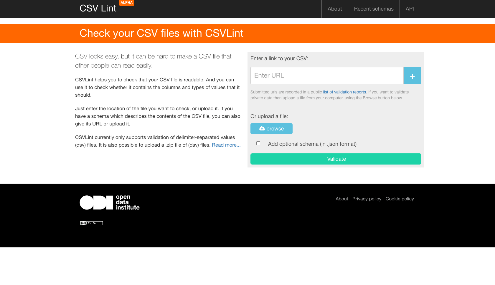
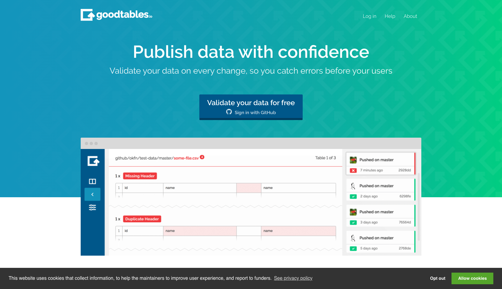
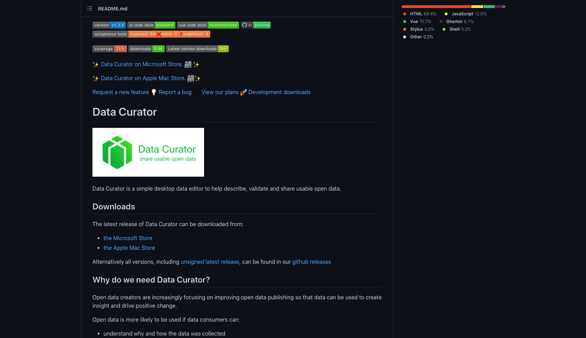
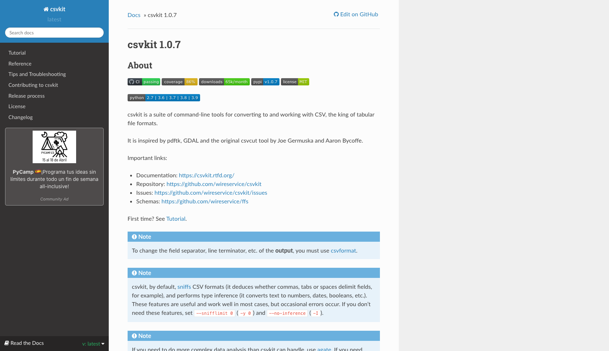

---
hide:
 - toc
# - navigation
title: Cassetta degli attrezzi per i file CSV
---

Ci sono **strumenti** disponibili per l'**elaborazione di file `CSV`** che forniscono una serie di **diverse funzionalità**, si tratta di **strumenti gratuiti** che di solito sono offerti come servizio, cioè sono disponibili online o richiedono l'installazione di software sul proprio computer. Sono in grado di **convalidare le strutture dei dati**, cioè la coerenza tra il numero di campi di intestazione e il numero di campi in ogni riga di dati, così come la **coerenza dei tipi e dei valori dei dati** in ogni cella. Si distinguono tra loro per la facilità d'uso e per specifiche funzionalità, sotto alcuni esempi.

| | Servizio/Suite di strumenti | Convalida della struttura | Pulizia dei dati | Conversione del formato |
| --- | --- | --- | --- | --- |
| **[CSV Lint](https://csvlint.io/)** | In linea | :material-check-bold:{ .spunta_verde } | :x: | :x: |
| **[Goodtables](https://goodtables.io/)** | In linea | :material-check-bold:{ .spunta_verde } | :x: | :x: |
| **[Data curator](https://github.com/qcif/data-curator)** | Suite | :material-check-bold:{ .spunta_verde } | :material-check-bold:{ .spunta_verde } | :material-check-bold:{ .spunta_verde } |
| **[CSV kit](https://csvkit.readthedocs.io/en/latest/)** | Suite | :x: | :material-check-bold:{ .spunta_verde } | :material-check-bold:{ .spunta_verde } |

## Strumento: CSV Lint

**:x: NON FUNZIONA TESTATO CON [CSV ISTAT](../../risorse/tabelle/demo_CSV_ISTAT.csv)**

**CSV Lint** è uno **strumento online** gestito dall'**Open Data Institute** realizzato per **verificare che un file `CSV` sia perfettamente leggibile e ben formato**, cioè verifica se contiene le colonne e i tipi di valori che dovrebbe. Permette di **convalidare file `CSV` e schemi di tabelle di dati**, l'analisi viene eseguita su file caricati direttamente su CSV Lint o disponibili online.
L'analisi **restituisce informazioni sugli errori** invalidanti per l'utilizzo dei dati, degli avvertimenti per elementi la cui correzione aiuta gli utenti dei dati e **messaggi informativi** su alcuni **consigli e suggerimenti** per facilitare l'utilizzo dei dati.
Lo strumento **genera un badge** che può essere **incorporato nel sito web del proprietario del file `CSV`** utilizzando il codice `HTML` corrispondente.
Alcuni **errori di codifica dei caratteri** vengono **corretti automaticamente**, generando una nuova versione standardizzata del file `CSV` originale, CSVLint tiene un registro delle convalide e degli schemi usati di recente che può essere utile per identificare gli errori comuni.

<figure markdown>
  
  <figcaption>CSVlint</figcaption>
</figure>

## Strumento: Goodtables

Googtables è un **servizio di validazione continua** per i dati tabulari della **Open Knowledge Foundation** (OKI) che permette la **verifica di errori e problemi comuni** nei file di dati tabulari. Goodtables può essere i**ntegrato come servizio** in diversi flussi di pubblicazione di Open Data, è in grado di convalidare dati tabellari in diversi formati: `CSV`, **file** prodotti da **Microsoft Excel** o da **LibreOffice Calc**, così come gli schemi dati in formato `JSON`. Permette anche la **convalida diretta di dati tabulari ospitati su Github o Amazon S3**, supporta `Tabular Data Package`[^1] che è un **formato semplice per la pubblicazione e la condivisione di dati** tabulari, promosso dal progetto FrictionLessData di OKI che **combina dati archiviati come `CSV`, schemi di tabella e metadati** secondo la specifica `DataPackage`[^2]. Goodtables è disponibile anche come libreria Python in modo che possa essere invocata per caricare e validare tabelle di dati.

[^1]: [Tabular data package](https://specs.frictionlessdata.io/tabular-data-package/#language)
[^2]: [Data package](https://specs.frictionlessdata.io/data-package/)

<figure markdown>
  
  <figcaption>Goodtables</figcaption>
</figure>

### Esempio

Le tabelle contenute nel repository GitHub che contiene questa guida cono state inserite nel monitoraggio continuo e l'esito è :material-check-bold:{ .spunta_verde } 

## Strumento: Data curator

**:x: NON FUNZIONA TESTATO CON [CSV ISTAT](../../risorse/tabelle/demo_CSV_ISTAT.csv)**

Data Curator è uno **strumento desktop** implementato dall'Open Data Institute che **permette la modifica, la convalida e la pubblicazione** di file di dati tabulari riutilizzabili come Open Data. Con questo strumento **è possibile generare dati tabulari** in formato `CSV`, `TSV`[^3], partendo da zero o da modelli di strutture dati e schemi. **Corregge automaticamente i problemi** comuni che si trovano nei file `CSV` ed in quelli prodotti con Excel. È possibile **creare automaticamente schemi** che descrivono i campi di dati e includono **specifiche regole di convalida** (ad esempio, unico, obbligatorio, lunghezza minima o massima o soggetto a espressioni regolari), così come **descrivere la provenienza dei dati**. Lo **strumento di convalida** analizza il file di dati rispetto allo schema definito e genera un file di valori separati nei vari dialetti `CSV` (separatore `,`, `;`, `TAB` o campi a larghezza fissa). Permette inoltre l'**incapsulamento dei dati e dello schema** per l'esportazione usando la specifica `Data Package`, i **file di dati descritti e validati** possono essere **pubblicati direttamente** sui portali di dati `CKAN`.

[^3]: `TSV` è un file di dati con estensione `tsv` in cui il separatore tra i campi è il `TAB` invece che la `,` come nel `CSV`.

<figure markdown>
  
  <figcaption>Data curator</figcaption>
</figure>

## Strumento: CSV kit

CSV kit è un **insieme di strumenti a riga di comando** da usare in ambienti Linux/MacOS[^4] per **convertire e lavorare con i file `CSV`**, tra le altre utili funzionalità, CSV kit **permette di convertire file creati con Excel o file `JSON` in `CSV` e viceversa**, permette inoltre di eseguire diverse **operazioni a livello di colonna, riga o cella** e di **generare sintesi statistiche ed eseguire query `SQL` sui dati**. Esegue anche alcune **analisi dei dati** e ne deduce alcune caratteristiche come l'assenza/presenza di intestazione o di tipi di dati.

[^4]: Può essere utilizzato anche in ambiente Windows attraverso il [WSL Windows Subsystem for Linux](https://docs.microsoft.com/it-it/windows/wsl/install)

<figure markdown>
  
  <figcaption>CSV kit</figcaption>
</figure>