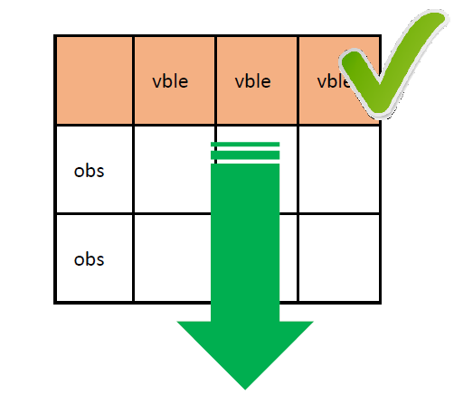

---
hide:
 - toc
title: Strutture dati verticale vs orizzontale
---

# Strutture dati verticale vs orizzontale
Quando si progettano strutture di dati tabulari è consigliabile evitare la crescita orizzontale dei valori.

Quando è possibile, è preferibile mettere le variabili o gli attributi dei dati nelle colonne di una tabella e aggiungere i valori corrispondenti alle osservazioni dei dati nelle righe.

La crescita orizzontale di una struttura di dati tabulari può rendere difficile la manutenzione e la creazione di visualizzazioni.

In generale, è più facile identificare le relazioni tra le variabili nelle colonne che tra le righe, ed è più facile fare confronti tra gruppi di osservazioni nelle righe che tra gruppi di colonne.

Tuttavia, questa raccomandazione dovrebbe essere adattata in base alle esigenze di aggiornamento dei dati:

- Se è necessario registrare nuove variabili o attributi che non sono stati registrati in precedenza, per esempio una serie temporale, allora è ragionevole far crescere la struttura dei dati orizzontalmente, cioè aggiungere nuove colonne. Questo permetterà di inserire le osservazioni per le nuove variabili mantenendo i valori vuoti nelle osservazioni pre-aggiornamento per queste nuove colonne, se non esiste un valore assegnabile per quelle osservazioni. Quando si aggiungono nuove osservazioni, si devono necessariamente inserire nuove righe.

**Esempio**: crescita orizzontale vs. verticale

!!! failure "Cattiva prassi"

    |marca|guasto_radiatore|guasto_carburatore|guasto_sospensione|guasto_frizione|
    |-------|-------------------|---------------------|-------------------------|-------------------------|
    |chevrolet chevelle malibu|0|7|1|0|
    |buick skylark 320|1|2|2|2|1|

!!! succes "Buona prassi"

    |marca|tipo_guasto|quantita_guasti|
    |-------|-----------|---------------------|
    |chevrolet chevelle malibu|radiatore|0|
    |chevrolet chevelle malibu|carburatore|7|
    |chevrolet chevelle malibu|sospensione|1|
    |chevrolet chevelle malibu|frizione|0|
    |buick skylark 320|radiatore|1|
    |buick skylark 320|carburatore|2|
    |buick skylark 320|sospensione|2|
    |buick skylark 320|frizione|2|
    |plymouth satellite|radiatore|0|
    |plymouth satellite|carburatore|4|
    |plymouth satellite|sospensione|4|
    |plymouth satellite|frizione|1|

L'esempio mostra un modo di organizzare i dati evitando la crescita orizzontale della struttura dei dati aggiungendo nuove variabili simili a quelle esistenti. La trasposizione in una struttura verticale creando due nuove variabili, '`tipo_guasto`' e '`quantita_guasti`', permette di aggiungere facilmente nuove osservazioni sotto forma di righe.

D'altra parte, quando vengono pubblicate serie temporali, per esempio la storia della domanda di veicoli per gli anni 1972-1977, la crescita orizzontale della struttura è ragionevole se si presenta la necessità, per esempio, di completare la serie temporale per gli anni '70.

|marca|1972|1973|1974|1975|1976|1977|
|-------|----|----|----|----|----|----|
|chevrolet chevelle malibu|345|423|1234|1690|2345|2134|04|27|
|buick skylark 320|124|252|785|914|1353|896|
|plymouth satellite|57|71|165|315|1104|1561|

